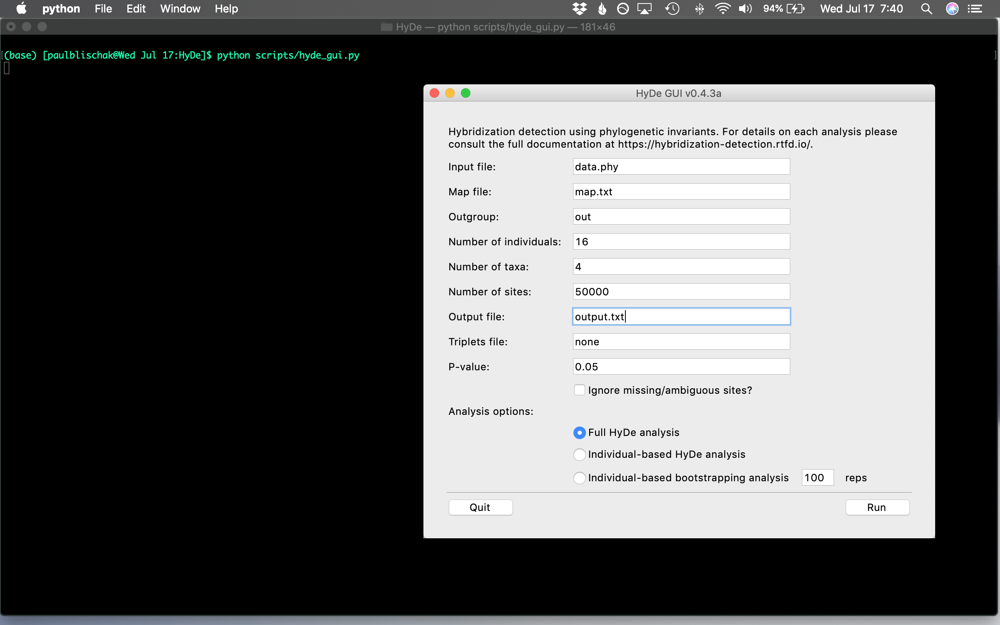

.. include:: links.rst

.. _GUI:

HyDe Graphical User Interface
=============================

.. note::
   
   To use the HyDe GUI, you will need to install the ``progress`` module, which is
   used to print out progress information for each analysis. The module can be installed using
   the following command:
   
   .. code::
      
      pip install progress

As of HyDe v1.0.0, users can conduct **single-threaded** hybridization detection analyses using
a graphical user interface (GUI) that is shipped with HyDe. With the ``phyde`` module installed,
the GUI can be launched by navigating to the folder with the data you would like to analyze
using a terminal window and typing ``hyde_gui.py``. This will launch the GUI window, allowing
you to type in the information for you analysis. Details about the analyses being conducted,
as well as any errors, will still be printed in the terminal window. 

   
   File names, analysis type, and other options can all be entered into the appropriate
   fields using the GUI. Users can then hit the ``Run`` button or press ``<Return>``
   to start an analysis.

